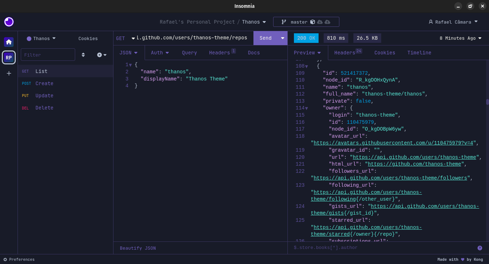

<h1 align="center">
   
  
   
  Thanos theme for <a href="https://insomnia.rest">Insomnia</a>
   
</h1>

  <strong>A theme made by a Titan to conquer the universe</strong>

  <a href="#install">Install</a> 👾
  <a href="#license">License</a> 👾
  <a href="#contributors">Contributors</a> 👾
  <a href="https://github.com/thanos-theme/thanos#colors">Colors</a> 👾
  <a href="https://github.com/thanos-theme/thanos#install">All Themes</a>

  

## Install

All instructions can be found at the [Installation Notes](./INSTALL.md).

## Contributors

This theme is a group effort by the following people listed at our [galactic contributors](https://github.com/thanos-theme/insomnia/graphs/contributors) list.

If you want to collaborate just follow the steps under our [Collaboration Guide](https://github.com/thanos-theme/thanos/blob/main/docs/COLLABORATE.md) and help the galactic domination of the mad titan.

| Creator                                                                                            |
| -------------------------------------------------------------------------------------------------- |
|  |
| [Rafael](https://github.com/rafael-camara)                                                          |

## License

[MIT License](./LICENSE.md)
